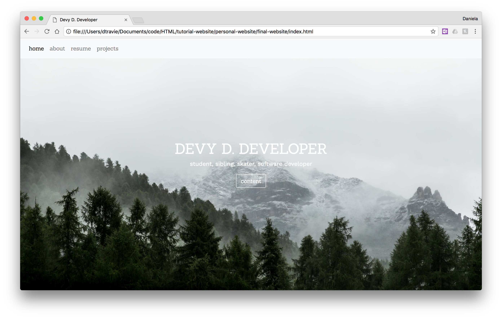

# Personal Website Tutorial
Welcome to this personal website tutorial! Today we're going to be using **HTML** (Hypertext Markup Language), **CSS** (Cascading Style Sheets), and a little **Javascript** to spice things up.

## Prerequisites
* Prior to this tutorial please install a text editor such as [Atom](https://atom.io/) or [Sublime](https://www.sublimetext.com/). I recommend Sublime because it's very lightweight and easy to use but I recommend Atom because it has a nice integration with Github and you can download packages to make it feel like an IDE (Integrated Development Environment).

* Download this repository

## What is HTML/CSS? What is Javascript?
Wikipedia says:
>Hypertext Markup Language (HTML) is the standard markup language for creating web pages and web applications. With Cascading Style Sheets (CSS) and JavaScript it forms a triad of cornerstone technologies for the World Wide Web.[2] Web browsers receive documents from a web server or from local storage and render them into multimedia web pages. HTML describes the structure of a web page semantically and originally included cues for the appearance of the document.

##What does it actually mean?
HTML is like a skeleton of a webpage. When you create a website, this is what gives it a structure. HTML is not a programming language. The neat but sometimes frustrating thing is that your browser will try its best to load your website even if you're missing brackets somewhere along the way.
CSS is what makes everything look pretty and you can even have some simple functionality built into CSS like drawing shapes or transformations.

>HTML can embed programs written in a scripting language such as JavaScript which affect the behavior and content of web pages.

Have you ever wondered why Facebook looks different every time you load it? Or why going to www.Facebook.com looks different with your friend's account than on yours? That's because Javascript is able to change the content of a webpage depending on variables.

## Let's take a look at the final product...
Before we begin let's see what it will eventually look like



[Here]("http://dtravie.com/tutorial-website/final-website/index.html") it is live:

WOW! :sparkling_heart:

It takes quite a bit of work to get to that point, however. Let's go on to look at how these languages all work together

## Inspect Element Tool

If you're using Chrome, right click on the website and select **Inspect**
If you're using Firefox, go to your menu bar and follow this chain: **Tools -> Web Developer -> Inspector**

Feel free to play around with it!

## Now onto the actual coding part...

##Quickstart guide to HTML/CSS
```html

<h1> Title </h1>
    <p>
        My first HTML snippet of code!
    </p>


```

HTML works by enclosing your content with tags that communicate information about how its supposed to look or act.
Structural tags include:
```html
    <html>
        <head>

        </head>
        <body>

        </body>
    </html>
```
Headers:
```html
    <h1> Big
    </h1>
        <h2> Medium
        </h2>
            ...
                <h#> Smol
                </h#>
```
Some more examples of different types of tags:
```html
    <p> This is a paragraph with a line <br> break
    </p>
    <a href = "https://www.google.com">This is an anchor tag</a>
```

HTML code is composed of command code (what it is) and variable code (defines how it changes)

```html
    </img>

```
```html
    <!-- The code within 'style' is CSS -->
    <div style = "text-align: center;
                    color: red;">
        <ul>
            This is an unordered list:
            <li>Feed the dog</li>
            <li>Make lunch</li>
            <li>Go to SEC's meeting</li>

        </ul>
    </div>

```
CSS is similar in that it has a selector (determines which element you want to change), a property (what you want to change about the element), and an attribute (how you change the element)
Below are some examples of the different types of selectors. For a more complete list here is a link: https://www.w3schools.com/cssref/css_selectors.asp
```css
    #example {
        /*selects elements with id = example*/
        width: 100px;
        height: 100%;
        background: #a4a89f;
    }
    .example {
        /*selects elements with class = example*/
        width: 100px;
        height: 100%;
        background: #a4a89f;
    }
    p{
        /*selects all elements with p tags*/
        text-align: center;
    }
    #example p{
        /*you can nest selectors, this is selecting all p tags within the division containing an id = example*/
        text-align: center;
    }

```

## More on structural tags
The head is at the beginning of your html code. The head contains meta data, scripts, links, and some other things you'd like to load to your website. The content in head is not displayed in your browser.

```html
<head>
    <meta ...>
    <link ...>
    <title></title>
</head>
```

This is all included with the starter-website index.html file so you don't have to worry about that right now.

The body contains the bread and butter of your website's HTML code. It's where you'd put all those p tags and img tags.

## This scary thing called Javascript
We will be using Bootstrap, an open-source, front-end framework. It contains templates we'll be calling upon in our files. This is Bootstrap's responsive navigation header which we will be using. If you remove the link in the header then our navigation bar looks completely different.

```html

    <nav class="navbar fixed-top navbar-expand-lg navbar-light bg-light" id = "navbar-font">

      <div class="collapse navbar-collapse" id="navbarNavDropdown">
       <ul class="navbar-nav">
         <li class="nav-item active">
           <a class="nav-link" href="#">nav<span class="sr-only">(current)</span></a>
         </li>
         <li class="nav-item">
           <a class="nav-link" href="#">nav</a>
         </li>

         <li class="nav-item">
           <a class="nav-link" href="#">nav</a>
         </li>

         <li class="nav-item">
           <a class="nav-link" href="#">nav</a>
         </li>

       </ul>
     </div>
    </nav>

```
And here's how we're changing the font of this navigation bar
```css
#navbar-font{
    font-family: 'Sanchez', serif;
}
```

##Let's make the landing page!

Feel free to write your name in the header and a quick blurb in the paragraph tags
```html
    <div class="image">
        <div class="text">
            <h1>...</h1>
            <p>...</p>
          </div>
    </div>
```
This looks kind of boring so let's spice things up by adding style to our style fyle

```css

    .image{
        background-image: url("img/forest.jpg");
        height: 100%;
        background-position: center;
        background-repeat: no-repeat;
        background-size: cover;
        position: relative;
    }
    .text{
        text-align: center;
        position: absolute;
        top: 50%;
        left: 50%;
        transform: translate(-50%, -50%);
        color: white;
        font-family: 'Work Sans', sans-serif;
    }

```

I want to make the header and the button look different from the rest, however, so we can play around with selectors to make it do just that

```css
.text h1{
    font-family: 'Sanchez', serif;
}
.text button{
    font-family: 'Sanchez', serif;

}
```

##Blog style posts

```html

    <div id = "first" class = "post">
        <h1></h1>

        <p id = "paragraph-post">
            Lorem ipsum dolor sit amet, consectetur adipiscing elit, sed do eiusmod tempor incididunt ut labore et dolore magna aliqua. Ut enim ad minim veniam, quis nostrud exercitation ullamco laboris nisi ut aliquip ex ea commodo consequat. Duis aute irure dolor in reprehenderit in voluptate velit esse cillum dolore eu fugiat nulla pariatur. Excepteur sint occaecat cupidatat non proident, sunt in culpa qui officia deserunt mollit anim id est laborum.
        </p>
    </div>

```
## Now you can scroll down...
But you can also use buttons to make this experience feel more dynamic! Let's add buttons to our landing and our blog style posts

```html
<p>
    <button type="button" class="btn btn-outline-light" onclick="...">NAME</button>
</p>

```
Try removing the class and type so you can see what a button looks like in plain HTML. As of right now clicking it doesn't do anything so this is where we're going to be using some Javascript to add functionality.
I found [this]("https://stackoverflow.com/questions/18071046/smooth-scroll-to-specific-div-on-click") code on Stack Overflow which allows us to scroll automatically when we click.
```Javascript
window.smoothScroll = function(target) {
    var scrollContainer = target;
    do {
        //find scroll container
        scrollContainer = scrollContainer.parentNode;
        if (!scrollContainer) return;
        scrollContainer.scrollTop += 1;
    } while (scrollContainer.scrollTop == 0);

    var targetY = 0;
    do {
        //find the top of target relatively to the container
        if (target == scrollContainer) break;
        targetY += target.offsetTop;
    } while (target = target.offsetParent);

    scroll = function(c, a, b, i) {
        i++; if (i > 30) return;
        c.scrollTop = a + (b - a) / 30 * i;
        setTimeout(function(){ scroll(c, a, b, i); }, 20);
    }
    // start scrolling
    scroll(scrollContainer, scrollContainer.scrollTop, targetY, 0);
}
```
## Challenge Time!
If you haven't noticed already, the project.html file is empty. I challenge you guys to finish it!
I recommend using 'cards'. Bootstrap's website has a neat content container which can hold information, pictures, and links. [Here]("http://getbootstrap.com/docs/4.0/components/card/") is the documentation from Bootstrap's website.
Another option is to use the slides/blog style posts we have on the homepage.
You can get creative with it and do something else entirely!
Email me your completed challenge or a live website or any other ways you get creative with this foundation and you'll get mad brownie points :sparkles:
With your permission, we can even feature your website on our Facebook and website!
## Helpful links, tips, and sources
Special thank you to [w3schools]("https://www.w3schools.com/") for being my main source of learning how to make websites!
[Bootstrap documentation]("https://getbootstrap.com/docs/4.0/getting-started/introduction/")
[Small html/css cheatsheet]("https://www.bluehost.com/blog/website-design/html-css-cheat-sheet-infographic-4181/")
[Unsplash photos]("https://www.Unsplash.com")
[HTML quickstart guide]("http://ptgmedia.pearsoncmg.com/images/9780321928832/samplepages/0321928830.pdf")
[Google fonts]("https://fonts.google.com/")
[Design inspo over at muz.li]("https://muz.li/")
[Hosting your website with github]("https://pages.github.com/")
## Thanks for following along!
My name is Daniela and my email is dtravie@gmail.com if you have any questions or comments
